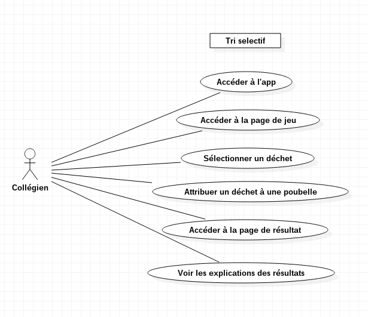
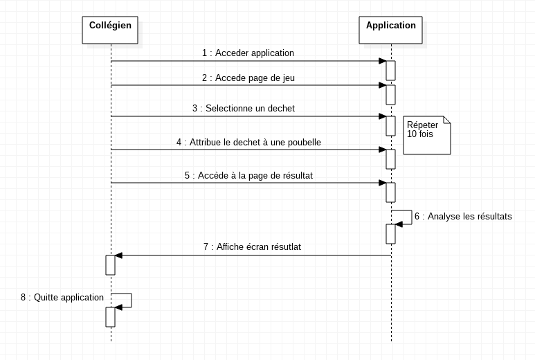
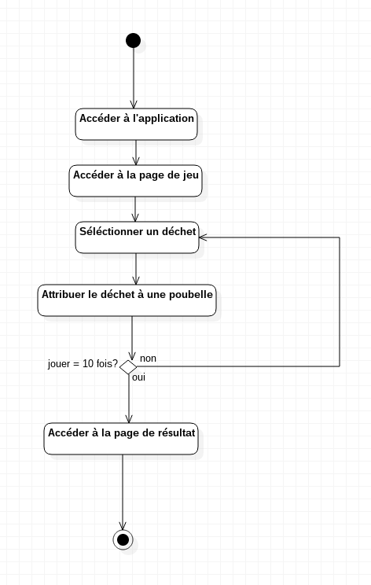
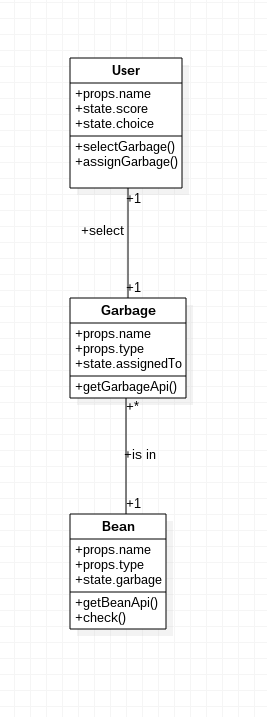

# Tri séléctif

## Diagrammes:
- [x] Créer le diagramme de cas d'utilisation 
- [x] Créer le diagramme de classe
- [x] Créer le diagramme séquence / activité

### Diagramme de cas d'utilisation :

### Diagramme de séquence

### Diagramme d'activité

### Diagramme de classe 

